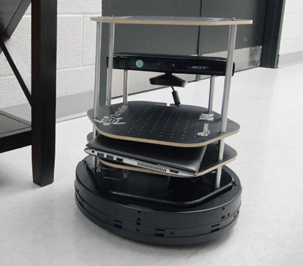

# UTM Robotics Club Projects

Welcome to the **UTM Robotics Club** project repository!  
Here you’ll find our current and past projects, along with a **Getting Started Guide** for anyone interested in contributing. I'll be updating this repository weekly, so stay tuned for more!

---

### Projects in Progress
- **Robot Arm** – A robotic manipulator we're desiging and constructing from scratch! Our goal is to integrate **computer vision** for object detection in the near future. Below I've listed an image of what our robot arm might look like!

- **Roomba** – Programming the **Kobuki TurtleBot** robots (a Roomba-like mobile robot) to perform autonomous **navigation** and **mapping** tasks with a camera and on-board odometry.

- **IR Line Follower** – A fully 3D-printable infrared line-following robot that we’re designing and building from scratch! Our goal is to create a simple, reproducible design that allows members to print, assemble, program, and race their own versions.

---

### Past Projects
- **Robot Dog** – A 3D-printed quadruped robot built using open-source designs by [Aaed Musa](https://www.instructables.com/3D-Printed-Robot-Dog/). Here's a video of ours walking!
[Cool Robot Dog](https://www.youtube.com/watch?v=-VGy4DMVPYc)

---

### Possible Future Projects
- **Robot Arm V2** - An advanced robotic manipulator inspired by the **Kuka KR5 Arc** robot. This is an improved version of **Robot Arm V1**, featuring stepper motor actuation and a sophisticated belt transmission.
- Feel free to share any ideas you may have!

---

## Getting Started Guide

We’re always excited to welcome new contributors to our projects—honestly, we could use a few more hands! If you’re eager to learn new skills, you’ll find plenty of opportunities to make meaningful contributions and grow along the way.

For each project in progress, you’ll find:
- Our current progress estimate
- The skills involved
- Helpful resources and instructions for getting started
- A detailed overview of the project’s goals and vision

Be sure to check out each project’s folder for current files and recommended learning materials!

---

## Robot Arm

The **Robot Arm** project is a robotic manipulator constructed from 3D-printed parts designed in **Fusion 360**. It uses **DS3240 40 Kg Servo Motors** for joint actuation and will be controlled by a microcontroller.

We also plan to mount an **Xbox Kinect Sensor** on the end-effector to experiment with **computer vision** using **OpenCV** (or potentially **ROS**). Example applications include:
- Autonomous sorting of colored blocks (with no prior knowledge of their positions)
- A fully automated game of checkers played by the arm

---

**Progress: [5%]**
We’ve completed the design of the robot’s base, including a custom bearing system.

**What’s next?** Designing the remaining joints of the arm — and then moving on to programming!

---

### Skills Involved
- 3D Modeling (e.g., Autodesk Fusion 360)
- Robotics Programming (e.g., inverse kinematics)
- Computer Vision (e.g., OpenCV, possibly ROS)
- Microcontroller Programming Basics (e.g., Arduino)

---

### The Vision
- The robot arm will resemble the one below, but with our own custom design and larger scale.

- We’re aiming to get smooth motion by designing **custom bearings** and integrating skateboard bearings into the joints.
- The software will involve robotics fundamentals, such as **inverse kinematics**, to control the arm.
- The end goal is to enable the robot to perform **autonomous** tasks such as the examples above.

---

### Where to Begin
- **Join us during office hours!** We’ll help you get started and guide you through whichever part of the project interests you most. You can also reach out to me anytime on the UTM Robotics Discord (my username is **daniil**) and I’ll be more than happy to help.
- If you’re starting with the **design phase**, learn **Autodesk Fusion 360** or another parametric CAD tool. UofT students can get Fusion 360 for free from Autodesk’s website.
  - Recommended tutorial series: [Fusion 360 Beginner Course](https://www.youtube.com/watch?v=y5tp4QXciK4&list=PLznyNXKQaKuetAIXhN-ihc1uhxti-oayo)  
    > Watching the first 4 videos is enough to get started, but there’s great advanced content further in the series!
- If you’re more interested in the **computer vision** side, you can start experimenting right away with the **Xbox Kinect Sensor** and your computer.
  - Recommended reading: [OpenCV Introduction Guide](https://www.opencv-srf.com/p/introduction.html)

## Roomba
The **Roomba** project focuses on programming the **Kobuki TurtleBot** (a Roomba-like mobile robot) to perform a variety of autonomous tasks. Each TurtleBot is equipped with an **Xbox Kinect Sensor** and several onboard sensors, including **wheel encoders** (for odometry), **bump sensors**, and **infrared sensors**.  

These robots offer a fantastic platform for exploring robotics concepts such as **navigation**, **mapping**, and **autonomous decision-making**. One of our main goals is to implement **visual SLAM**, allowing the robots to map and navigate their environment in real time.

---

**Progress:** [10%]  
We’ve successfully completed the setup of the **ROS** libraries used to communicate with the robots (this took us a while to figure out!). The Turtlebots can now be run remotely on a **Raspberry Pi**.  

**What’s next?** Developing advanced functionality such as **autonomous navigation**, **path planning**, and **environment mapping** using **ROS** frameworks and computer vision tools.

---

### Skills Involved
- Robotics Programming with **ROS**
- Computer Vision

---

### The Vision
- Create a fleet of autonomous TurtleBots capable of navigating and mapping their surroundings (we have 8 robots total!).  
- Implement **visual SLAM** to enable real-time environment perception.  
- Explore any other cool ideas!

---

### Where to Begin
- **Join us during office hours!** We’ll help you get started and guide you through whichever part of the project interests you most.  
  You can also reach out to me anytime on the **UTM Robotics Discord** — my username is **daniil** — and I’ll be more than happy to help.  
- Come experiment with the TurtleBots! We’re still gaining hands-on experience with them, so we’ll learn and troubleshoot together.  
- I haven't looked into this tutorial myself, but I thought it might be useful. It explains how to use **ROS** to perform robot navigation!
  [Robot Navigation with ROS](https://www.youtube.com/watch?v=jkoGkAd0GYk&t=108s)

## IR Line Follower

The **IR Line Follower** is a fun mini-project that will involve building a **PID-controlled infrared line-following robot** capable of tracking a black line on a surface.

We plan to design and 3D-print the robot’s chassis using **Fusion 360**, similar to the **Robot Arm** project. This project is meant to be approachable and quick to complete.

Eventually, we hope to turn this into a **fun community event**, where participants can build their own line-following robots and **race them on a track**!

---

**Progress:** [25%]  
As of now, we have implemented the code for the robot.

**What’s next?**  
- Designing the chassis in **Fusion 360**
- Assembling the electronics and wiring up the **IR sensor array**  
- Tuning the **PID control algorithm**
- Setting up a **race track** for testing and competitions!

---

### Skills Involved
- 3D Modeling (e.g., Autodesk Fusion 360)  
- Microcontroller Programming (e.g., Arduino)  
- Control Systems (PID tuning and feedback loops)  

---

### The Vision
- Design a neat robot capable of accurately following a black line using IR sensors.  
- Implement a well-tuned **PID controller** to ensure smooth and responsive motion.  
- Create a fun, interactive **racing event** where participants can test their robots and compete.  

---

### Where to Begin
- **Join us during office hours!** We’ll help you get started and guide you through the design and programming process.  
  You can also message me anytime on the **UTM Robotics Discord** — my username is **daniil** — and I’ll be more than happy to help.  
- Start by learning the basics of **PID control** — how proportional, integral, and derivative terms affect robot movement.  
- If you’re interested in designing your own robot chassis, learn **Autodesk Fusion 360** or another parametric CAD tool. UofT students can get Fusion 360 for free from Autodesk’s website.
  - Recommended tutorial series: [Fusion 360 Beginner Course](https://www.youtube.com/watch?v=y5tp4QXciK4&list=PLznyNXKQaKuetAIXhN-ihc1uhxti-oayo)  
    > Watching the first 4 videos is enough to get started, but there’s great advanced content further in the series!
- Explore tutorials on **IR sensors** and **Arduino** motor control to prepare for building and testing your own line follower!
